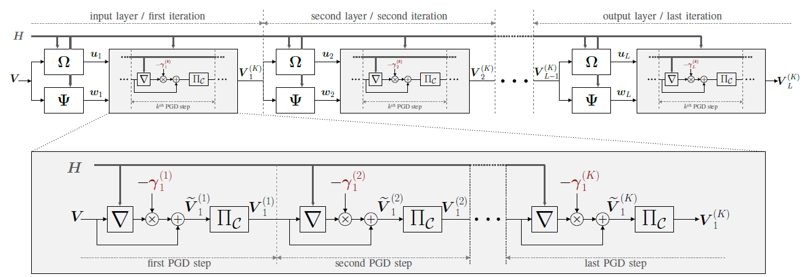

# Deep unfolding of the weighted MMSE beamforming algorithm

This GitHub repository complements our paper [[1]](#ourpaper). The user can find the code used to reproduce the plots in the paper.
In our paper we propose the novel application of **deep unfolding** to the weighted minimum mean squre error (WMMSE) in [[2]](#WMMSE_Shi).
The WMMSE algorithm is an iterative algorithm that converges to a local solution of the weigthed sum rate maximization problem subject to a power constraint, which is known to be NP-hard. As noted in [[3]](#WMMSE_E2E), the formulation of the WMMSE algorithm, as described in [[2]](#WMMSE_Shi), is not suitable to be unfolded due to the matrix inversion, the eigenvale decomposition, and bisection search performed at each itearation of the algorithm. Therefore, in our paper [[1]](#ourpaper), we propose an alternative formulation that avoids these operations. Specifically, we replace the method of Lagrangian multipliers with the **projected gradient descent (PGD) approach**. 

In the jupyter notebook "Unfolded_WMMSE_versus_WMMSE.ipynb" the implementation in Python 3.6.8 of the WMMSE algorithm in [[2]](#WMMSE_Shi) and the implementation in Python 3.6.8 and Tensorflow 1.13.1 of the unfolded WMMSE algorithm can be found.

## Problem formulation
Let  be the transmitted data symbol and let  be the channel.

With linear beamforming, the signal at the receiver is 

where  is the transmit beamformer for user  and where  is independent additive white Gaussian noise with power . The signal-to-interference-plus-noise-ratio (SINR) is 

The estimated data symbol at the receiver is , where  is the receiver gain.

We seek to maximize the weighted sum rate (WSR) subject to a total transmit power constraint, i.e., 

where  indicates the user priority (assumed to be known) and where  is the maximum transmit power at the base station. We assume to have perfect channel knowledge.

## Proposed unfolded WMMSE algorithm
Algorithm 1 reports the pseudocode of the unfolded WMMSE and Fig 1 depicts the overall neural network architecture.

*The neural network architecture obtained by unfolding  iterations of the WMMSE and  projected gradient descent (PGD) steps per iteration. The subscript  corresponds to the  layer/iteration and the superscript  corresponds to the  PGD step. The trainable parameters, highlighted in red, are the step sizes of the PGD approach. Each layer of the neural network is given by the update equation of , indicated by , by the update equation of , indicated by , and by unfolding  PGD steps, as depicted in the gray box. In particular,  and  indicate the gradient and the projection operations, respectively.*  

## Computation Environment
In order to run the code in this repository the following software packages are needed:
* `Python 3` ( for reference we use Python 3.6.8 ), with the following packages:`numpy`, `tensorflow` (version 1.x - for reference we use version 1.13.1) , `matplotlib`,`copy`,`time`.
* `Jupyter` ( for reference we use version 6.0.3 )

## Reference

 [1] L. Pellaco, M. Bengtsson, J. Jaldén, "Deep unfolding of the weighted MMSE algorithm," submitted to IEEE Transactions of Signal Processing.

 [2] Q. Shi, M. Razaviyayn, Z. Luo and C. He, "An Iteratively Weighted MMSE Approach to Distributed Sum-Utility Maximization for a MIMO Interfering Broadcast Channel," in IEEE Transactions on Signal Processing, vol. 59, no. 9, pp. 4331-4340, Sept. 2011, doi: 10.1109/TSP.2011.2147784.

 [3] H. Sun, X. Chen, Q. Shi, M. Hong, X. Fu and N. D. Sidiropoulos, "Learning to Optimize: Training Deep Neural Networks for Interference Management," in IEEE Transactions on Signal Processing, vol. 66, no. 20, pp. 5438-5453, 15 Oct.15, 2018, doi: 10.1109/TSP.2018.2866382.

